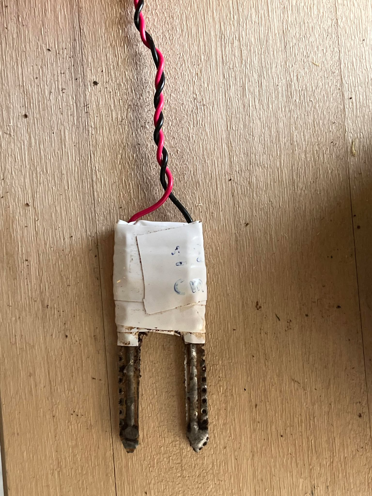

Necessary electrical components
=====================================

| Component                            | Quantity |
|--------------------------------------|----------|
| Raspberry Pico                       | 1        |
| Micro USB wire with data transfer    | 1        |
| Moisture prongs                      | 1        |  (check moisture_prongs.png)
| Biltema Inline-pump 12V              | 1        |
| SRD-05VDC-SL-C relay                 | 1        |
| bc546 B transistor                   | 1        |
| 100k ohm resistor                    | 2        |
| Button                               | 1        |
| 9V battery                           | 1        |
| 9V battery connector                 | 1        |
| Bale-female breadboard wire          | 3        |
| Breadboard wire                      | X(m)     |

Necessary other components
=====================================

| Component                            | Quantity |
|--------------------------------------|----------|
| Water can                            | 1        |
| Plastic tubing                       | X(m)     |  (make sure they fit pump output)

# Moisture prongs  
these are basically glorified nails in the soil  
