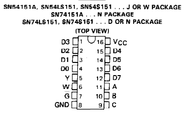

List of potential future components
=====================================

| Component                            | Link     |
|--------------------------------------|----------|
| Magnetventil 4-port 12V              | https://www.electrokit.com/magnetventil-4-port-8mm-12v        |
| Solenoid liten 5V                    | https://www.electrokit.com/solenoid-liten-5v                  |
| Kolla om ETA har  tunn isolerad kabel| Bygg egen elektromagnet        |  
| Elektromagnet ø20x15mm 2.5Kg         | https://www.electrokit.com/elektromagnet-20x15mm-2.5kg-1      |
| Gör en låda för allt                 |      |
|fär mer schematics		       | https://www.circuit-diagram.org/editor/|
|||
|shiftregister|for controlling electromagnet|
|multiplexer|for getting input from moisture_probe|

# Multiplexer SN74LS151  

datasheet: https://www.ti.com/lit/ds/symlink/sn74ls151.pdf?ts=1742149660463&ref_url=https%253A%252F%252Fwww.ti.com%252Fproduct%252FSN74LS151%253Futm_source%253Dsupplyframe%2526utm_medium%253DSEP%2526utm_campaign%253Dnot_alldatasheet%2526DCM%253Dyes%2526gad_source%253D7%2526dclid%253DCKCXytL2jowDFXRZpAQd8KECTg  

### Important notes for the SN74LS151:  
All data-in pins (D0-D7) need to have a pulldown resistor to ground otherwise unexpected behavior.  
G has to be connected to ground  

info: It doesnt work in reverse.

